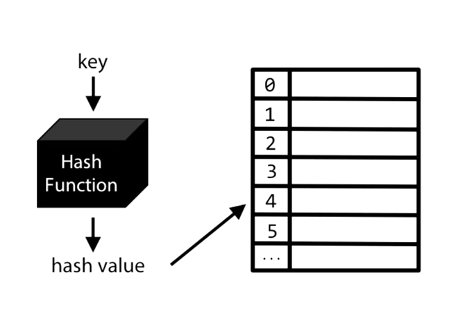
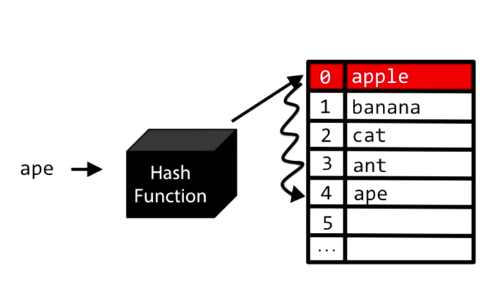
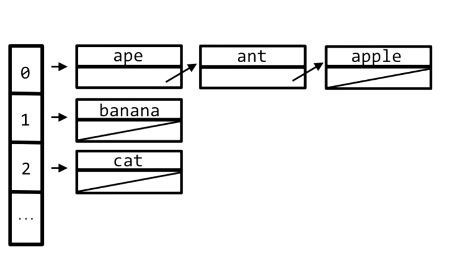

#HASH TABLE
by Jose Torres [@CoderPug](http://www.github.com/coderpug)

##Concepts
- Composed by two parts : a table/array + a hash function.
- Flexible size. It can grow over time.
- Store data of any type.
- Used when speed is required for insertion, deletion and lookup.
- Does not support duplicated elements.

##Operations
- The hash function takes a key as input an output an integer/hash value that maps to a specific position in the table/array.

Therefore
- The hash function determines the index of where a value will be stored.
- The hash function determines the index of where a value has been stored.
- It is crucial that the hash function keeps consistency and output the same index value for identical keys.
  - A good hash function uses all info provided by key.
  - Uniformly distribute output across table/array.
  - Maps similar keys to very different hash values.
  - Uses only very fast operations.

##Collision
When two or more keys receive the same index from the hash function.
##### Method A. Linear probing
- When receiving the same key. The value is stored in the next available slot in the table/array.
- Everytime this happens it increases chances of more collisions. (problem known as clustering).
- Changes worst case scenarios of insertion, deletion and lookup to O(n).

##### Method B. Separate Chaining
- For this model the table/array is an array of pointers to individual linked lists.
- When collision occurs insertion can be done at constant time. O(1).
- Worst case scenario is O(n/k) where k is size of the hash table -> O(n). Theoretically the same as a worst case time for a lookup in Linked lists, but in real world it makes a huge improvement.

##Representation
- A hash function + a hash table / array / linked list.

##Complexity
- Insert: O(1)
- Remove/Deletion: O(1)
- Lookup: O(1)

##Direct Applications
- Whenever handling huge amount of registers and where we will be performing huge amounts of insertion/deletion/lookups.
- Rabin-Karp Algorithm <https://en.wikipedia.org/wiki/Rabin%E2%80%93Karp_algorithm>
- Cryptography like MD5
- More detailed applications: <https://www.quora.com/What-are-some-practical-applications-of-hashing>

##Problems

- Hackerrank: Cracking the Coding <https://www.hackerrank.com/challenges/ctci-ransom-note>
- Hackerrank: Ruby array & hashes <https://www.hackerrank.com/domains/ruby/ruby-arrays>

##Bibliography

- <https://en.wikipedia.org/wiki/List_of_data_structures>
- <https://www.youtube.com/watch?v=h2d9b_nEzoA>
- <https://www.hackerrank.com/topics/hashing> <http://www.scielo.br/scielo.php?script=sci_arttext&pid=S0101-74382015000200423>

*I totally stole the images from CS50 - <https://www.youtube.com/watch?v=h2d9b_nEzoA*