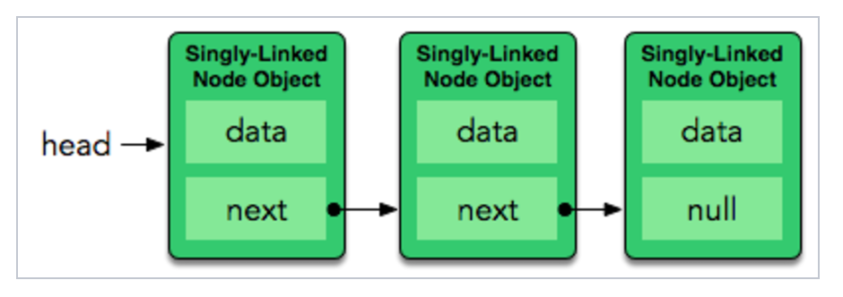
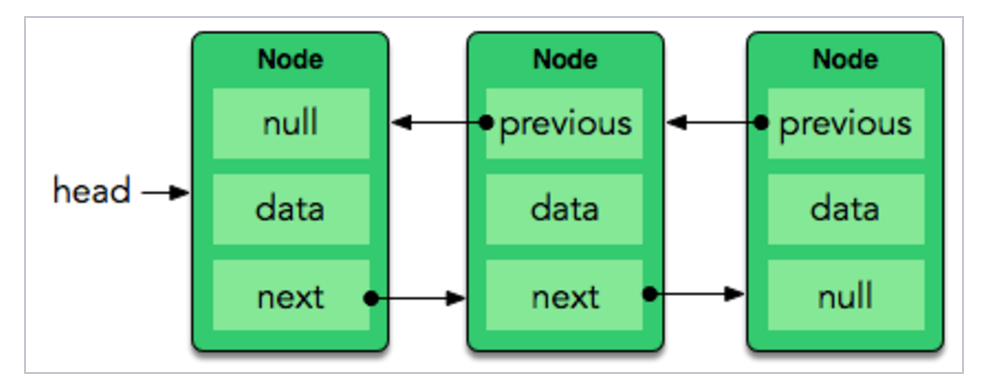
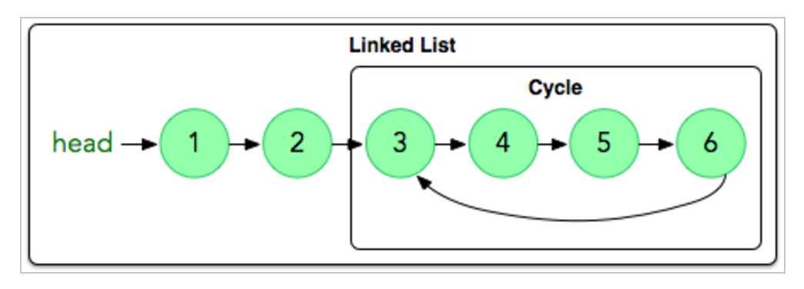

#LINKED LIST
by Jose Torres [@CoderPug](http://www.github.com/coderpug)

##Concepts
- List of elements not necessarily contiguous in memory.
- Flexibility to grow.

#### Singly-Linked list
- A data structure with a list of elements where each element (node) contains a value and a pointer reference to the next element. 
- Null value on the pointer means the end of the list.
- Allows only forward iterations.

#### Doubly-Linked list
- A Singly-Linked list where each element (node) also contains a pointer reference to the previous element (node).
- Allows forward and backward iterations.

## Cycles
- Happens when the 'last' element (node) of the list points to a previous element inside the list.
- Cause infinite loops.
- Approaches for solving this issue : 

#### A
- Include a boolean value inside the element (node) definition.
- The boolean value indicates if the elements was previously visited.

#### B
- Use an algorithm that keeps multiple references and iterate over the list to check if at some point the references are the same.

##Operations
-

##Representation
- 

##Complexity
- Insert: O(1) / O(n)
- Remove/Deletion: O(1) / O(n)
- Lookup: O(n)

##Direct Applications
- As a real basic structure it can be used whenever grow flexibility in a list is required. i.e queues, stacks

##Problems

- Hackerrank: Cracking the Coding <https://www.hackerrank.com/challenges/ctci-linked-list-cycle>
- Hackerrank: Linked-lists <https://www.hackerrank.com/domains/data-structures/linked-lists>

##Bibliography

- <https://en.wikipedia.org/wiki/List_of_data_structures>
- <https://www.hackerrank.com/topics/linked-lists>

*I totally stole the images from HackerRank - <https://www.hackerrank.com/topics/linked-lists>*
